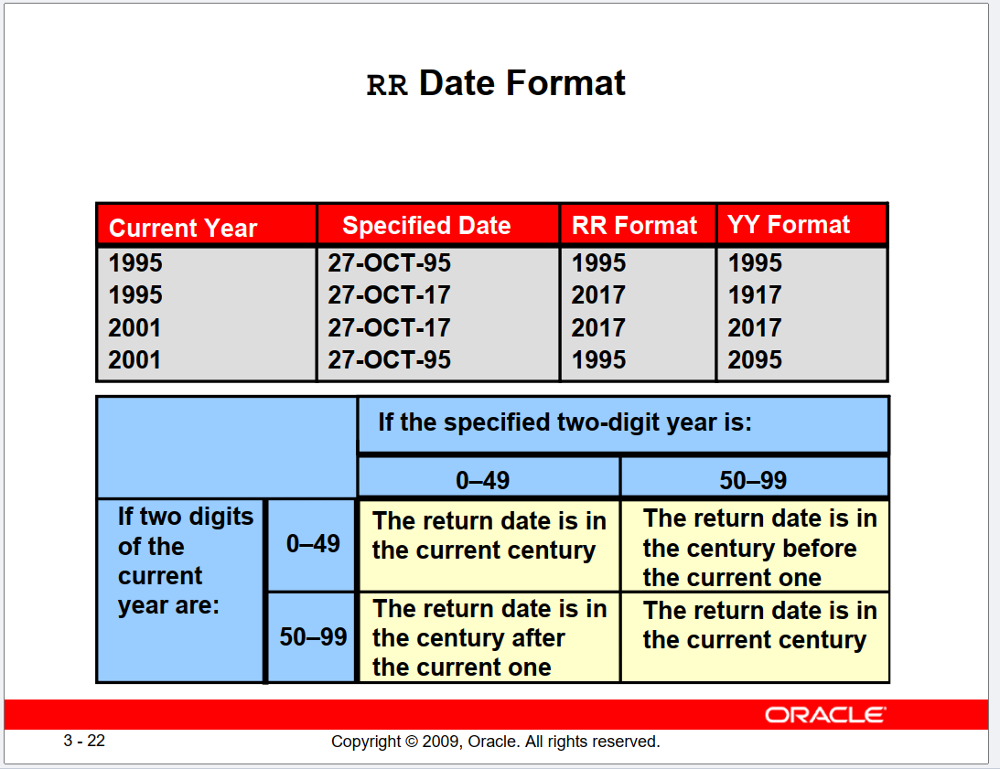
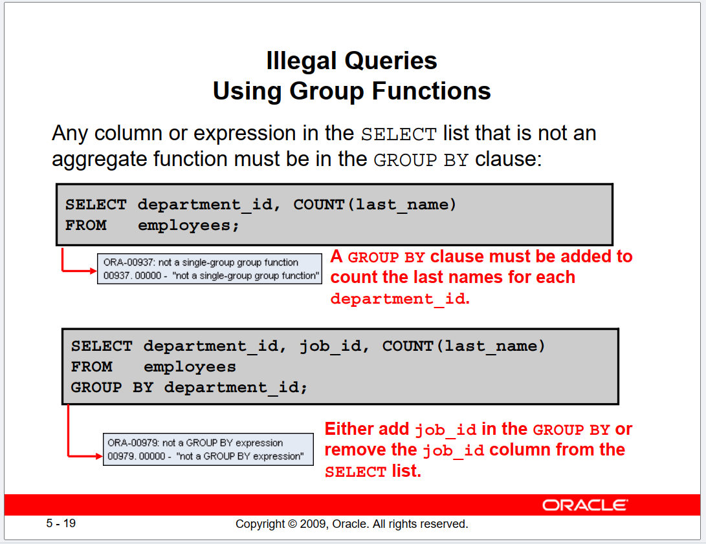
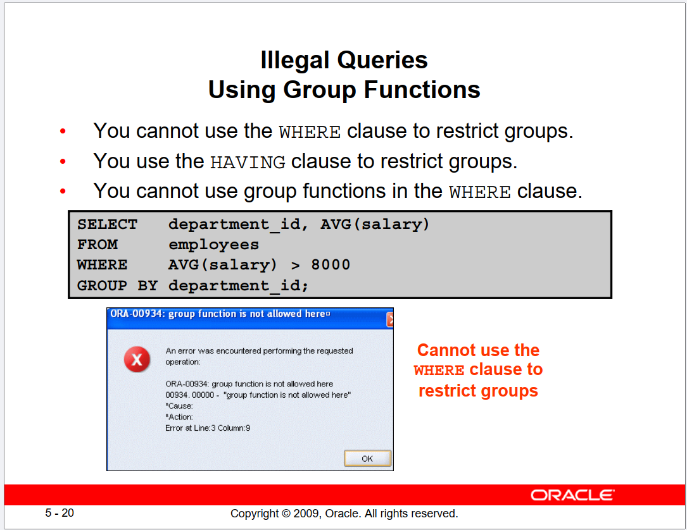

# DataBase section

## Section 1

### Viewing columns

To select the whole table
```sql
select * from employees
```
but you can replace the '*' it with whatever column name u need

Alternatively you can use `Describe [tablename]` to get a better view of the table structure

To view distinct rows without any repeating values we use the 'distinct' keyword

```sql
select distinct department_id, first_name from employees
```

You can also use arithmetic operators :
**+ addition, - subtraction, * multiplication, / division** and don't forget the ordering for of arithmetic operators

```sql
select last_name, salary, 12*(salary+100)
from employees;
```

> Note that NULL values aren't affected by any arithmetic operations

### Column Alias

To change the name viewed for a column there is two ways to choose from:

- By using the 'as' keyword after the column name then specifying the name u want to be shown

```sql
select last_name as name, commission_pct comm
from employees;
```

- Just typing the name after the column name in double quotation

```sql
select last_name "name", commission_pct "comm"
from employees;
```
### Concatenation

To show to multiple branches in the same column we use '||' and we can also use alisases with it

```sql
select first_name||' is '|| job_id as "Description"
from employees;
```

You can also use different delimiting characters by using ' q'' '

```sql
select first_name || q'#'s salary is: #' ||salary as "Employee salary"
from employees;
```


<br><br>

## Section 2

### selecting specific rows from a table
you can use the keyword 'Where' to select specific rows according to conditions you set yourself

```sql
select first_name , last_name, department_id
from employees
where department_id = 90;

select last_name
from employees
where last_name ='King'

select first_name , hire_date
from employees
where hire_date between '01/01/2005' and '01/30/2005'
```

| Operator | Meaning |
| -------- | ------- |
|=                      |Equal to |
|>                      |Greater than|
|>=                     |Greater than or equal to|
|<                      |Less than|
|<=                     |Less than or equal to|
|<>                     |Not equal to|
|between ... and ...    |Between two values (inclusive)|
|in (x,y,z,...)         |Match any of the values in the set|
|like ' '               |Match a character pattern|
|is null                |Is a null value|

The value after between must be the lower not the higher one or else it won't run

Like is used to perform wildcard searches and can contain either literal characters or numbers
- % denotes zero or many characters
- _ denotes one character

**You can also use more than one condition using Logical operators**

| Operator  | Meaning    |
| --------- | ---------- |
|and        |Returns TRUE if both component conditions are true|
|or         |Returns TRUE if either component condition is true|
|not        |Returns TRUE if the condition is false|

```sql
select first_name , hire_date, last_name, manager_id, salary
from employees
where manager_id not in (100,103)

select first_name , hire_date, last_name, manager_id, salary
from employees
where salary >=5000 and job_id like '%MAN%'
```

**Rules of precedence**
Parentheses -> Arithmetic operators -> Concatenation operator -> Comparison conditions -> IS [NOT] NULL, LIKE, [NOT] IN -> [NOT] BETWEEN -> Not equal to -> NOT logical condition -> AND logical condition -> OR logical condition

### Sorting the rows

The keyword 'order by' can be used to arrange the rows according to certain conditions you set yourself asscendingly or descendingly (the default is ascending tho)

```sql
/*order by descending order*/
select first_name , hire_date, last_name, manager_id, salary
from employees
order by salary;

/*order by column number (Salary column is 5th column, look at the table structure to make sure)*/
select first_name , hire_date, last_name, manager_id, salary
from employees
order by 5 desc;

/*order by alias name*/
select first_name name , hire_date, last_name, manager_id, salary
from employees
order by name;

/*order by more than one column*/
select first_name name , hire_date, last_name, manager_id, salary
from employees
order by name , salary;
/**/
/**/
```

Ordering by multiple columns orders the rows by the first argument first (in the example above it's name) then if two rows have the same first value then the second argument is used

**from slide 29 till the end isn't on the test 🤩**
<br><br>
## Section 3

### Functions in SQL

There are two types of functions:

- Single-row functions
- Multiple-row functions

**Single-row functions:**
- Manipulate data items
- Accept arguments and return one value
- Return one result per row
- Can be nested
- Accept arguments that can be a column or an expression
- May modify the data type
- Act on each row that is returned

**Case-conversion functions**

| Function  | Result    |
| --------- | ----------|
|LOWER('SQL Course')    |sql course |
|UPPER('SQL Course')    |SQL COURSE |
|INITCAP('SQL Course')  |Sql Course |

```sql
/*Upper and Lower functions*/
select upper(last_name) as "Last Name"
from employees
where lower(last_name)= lower('king');

/*Initcap function*/
select initcap(first_name) as "First Name" , initcap(last_name) as "Last Name"
from employees;
```

**Character-manipulation functions**

| Function  | Result    |
| --------- | ----------|
|CONCAT('Hello', 'World')                       |HelloWorld     |
|SUBSTR('HelloWorld',1,5)                       |Hello          |
|LENGTH('HelloWorld')                           |10             |
|INSTR('HelloWorld', 'W')                       |6              |
|LPAD(salary,10,'*')                            |*****24000     |
|RPAD(salary, 10, '*')                          |24000*****     |
|REPLACE BLACK and BLUE('JACK and JUE','J','BL')|BLACK and BLUE |
|TRIM('H' from 'HelloWorld')                    |elloWorld      |

```sql
/*concat*/
select concat(first_name, concat(' ',last_name)) as "Full Name"
from employees

/*SUBSTR*/
select substr (last_name,1,3)
from employees

/*SUBSTR if it took only 2 parameters*/
select substr(last_name,3)
from employees

/*LENGTH*/
select length (last_name)
from employees

/*INSTR (take 2 arguments)*/
select instr (first_name,'i')
from employees

/*RPAD*/
select rpad (salary, 5,'*')
from employees

/*LPAD*/
select lpad (salary,7,'*')
from employees

/*REPLACE*/
select replace ('Jack and Blue','J','B')
from dual

/*TRIM*/
select trim ('b' from 'blue')
from dual
```

> The dual in the last two examples can be used to select a constant value and return that constant value.

**Number Functions**

| Function  | Result    |
| --------- | ----------|
|ROUND(45.926, 2)   |45.93  |
|TRUNC(45.926, 2)   |45.92  |
|MOD(1600, 300)     |100    |

```sql
select round (63.54,-2) /*0,50,100 -> 63 nearer to 100 =100*/
from dual

select round (55.54,-1) /*5 a2rb lel 10 fa hatb2a 50+10=60*/
from dual

select round (40.45,-2) /*40 nearer to 0 <50*/
from dual
```

*Round rounds up to the specified decimal but Trunc just omits every decimal digit till a the specified decimal*

### Working with dates



To view or get the current date and time and you can also do arithmetic operations with it:

```sql
select round ((sysdate-hire_date)/7)
from employees;
```
### Date Functions

| Function  | Result    |
| --------- | ----------|
|MONTHS_BETWEEN |Number of months between two dates |
|ADD_MONTHS     |Add calendar months to date        |
|NEXT_DAY       |Next day of the date specified     |
|LAST_DAY       |Last day of the month              |
|ROUND          |Round date                         |
|TRUNC          |Truncate date                      |

```sql
/*Month_between*/
select round( months_between (sysdate,hire_date))
from employees

/*Add month*/
select add_months(sysdate,1)
from employees

/*Next day*/
select next_day(sysdate,'friday')
from employees

/*Last day*/
select last_day (sysdate)
from employees

select round (sysdate,'month') >1/5/2024 as today is 26/4/2024
from employees

select round (sysdate ,'year') /*1/1/2024 as today is 26/4/2024 : april more near to 2024 not 2025*/
from employees

select trunc (sysdate, 'month') /*hayrg3 lyom wa7ed fi el 4ahr*/
from employees

select trunc (sysdate,'year') /*hayrg3 lyom wa7ed fi el sana*/
from employees
```

## Section 4

*nu uh*
<br><br>
## Section 5

### Group functions

| Function  | Result    |
| --------- | ----------|
|avg (row_name)     |returns the average value of all the values in a row       |
|max (row_name)     |returns the maximum value of all the values in a row       |
|min (row_name)     |returns the minimum value of all the values in a row       |
|sum (row_name)     |returns the sum of all the values in a row                 |
|count (*)          |returns the number of rows in a table                      |
|count (row_name)   |returns the number of rows with non-null values for expr   |

```sql
/*avg function with nvl*/
select AVG(NVL(commission_pct, 0))
from employees;
```

**Note that:**
- These functions can't be used with normal fields in the select statement but can be used with each other unless you use `group by` clause
```sql
/*This is wrong*/
select avg(salary), first_name 
from employees;

/*This is right*/
select avg(salary), first_name
from employees
group by first_name;
```
- Count can be used with the distinct keyword
- Group functions ignore null values in the column so we can use the NVL function to include them

### Grouping the data

You can divide rows in a table into smaller groups by using the `group by` clause and it can be used for column that aren't included in the select statement

*Basically it groups a the result of a group function according to another row like in the first example*

```sql
/*normal group by*/
select AVG(salary)
from employees
group by department_id ; /*Displays the average salary for each group with the same department_id number*/

/*group by but with ordering*/
select department_id, job_id, SUM(salary)
from employees
group by department_id, job_id
order by department_id;
```

**Illegal Queries**


<br>


### Restricting group results

When you use the having clause, the Oracle server restricts
groups as follows:
1. Rows are grouped.
2. The group function is applied.
3. Groups matching the having clause are displayed.

```sql
/*Shows only the grouped data (by department_id ofc) that have max salary above 10000*/
select department_id, MAX(salary)
from employees
group by department_id
having MAX(salary)>10000 ;

/*Shows only the grouped data that doesn't have job_id that include the word "REP" (by job_id ofc) w that have a sum of 13000 salary and orders it by sum of salary*/
select job_id, SUM(salary) PAYROLL
from employees
WHERE job_id NOT LIKE '%REP%'
group by job_id
having SUM(salary) > 13000
order by SUM(salary);
```

### Nesting gruop functions

```sql
/*calculates the average salaries for each group by department_id and then diplays the biggest one*/
select MAX(AVG(salary))
from employees
group by department_id;
```
<br><br>

## Section 6